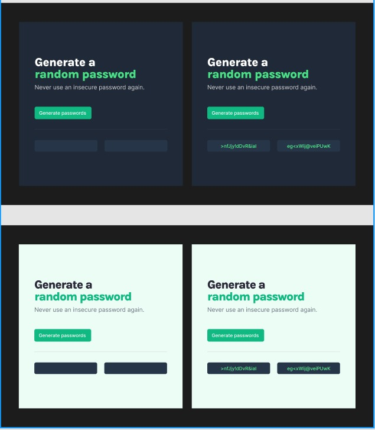

# Random Password Generator

This Solo project is from a [Scrimba](https://scrimba.com/) course.

[Learn Javascript for free](https://scrimba.com/learn/learnjavascript):
- For beginner
- Interactive
- a lot of codice challanges

Also if I am intermediate level, am following this course to improve my skills and practice at least one hour per day, relaxing after work.

### Project Requirements
- Build it from scratch
- Generate two random passwords when the user clicks the button
- Each password should be 15 characters long

### Stretch goals
- Ability to set password length
- Add “copy on click”
- Toggle symbols and numbers on/off

## Design

The design is provided from the course on Figma.

